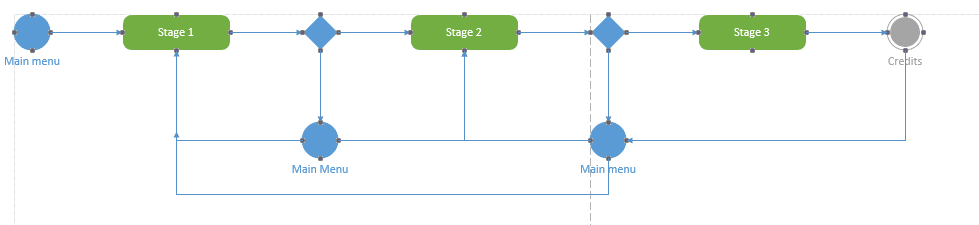

# Table of Contents
1. Structure
2. Additional Components and Packages
3. Gameplay
4. SAD Diagram

# Structure
doc - Holds documentation for the game.

src - Holds the files necessary to execute the game such as the html and the asset files such as the png files.

Packages- We will be using npm as a package manager for the Phaser library.

Tasks- We will use gulp to turn multiple files into one executable file. 

Browser- The game will run inside the browser. 

# Additional Components and Packages
Phaser - This is the JavaScript library that we will be using to produce a game. 

Nodejs - Allows us to execute JavaScript outside the browser.

# Gameplay 
During gameplay the user will interact with various componets of the game. For example as the player is trying to collect enough xp to move to the next level, enemies will attack the user. The user will have access to inventory so that they can have access to food, weapons , etc.

# SAD Diagram
UML Activity Diagram describing the workflow of the game.

